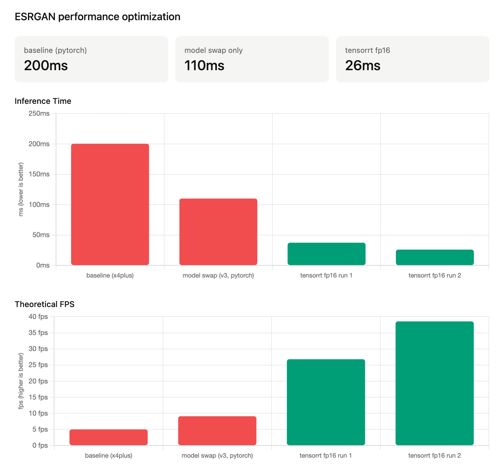

# Real-ESRGAN TensorRT Inference Pipeline

An optimized inference pipeline for image super-resolution built on top of [Real-ESRGAN](https://github.com/xinntao/Real-ESRGAN) by [Xintao Wang](https://github.com/xinntao). This project focuses on adapting it for video and reducing inference latency through model selection, TensorRT FP16 export, and CUDA-accelerated inference — achieving an **87% reduction in inference time** from the baseline.

---

## Results

| Optimization | Inference Time | FPS | Hardware |
|---|---|---|---|
| Baseline (RealESRGAN_x4plus, PyTorch) | 200ms | 4.99 | AMD 7900XTX |
| Model swap (realesr-general-x4v3, PyTorch) | 110ms | 9.09 | AMD 7900XTX |
| TensorRT FP16 (run 1) | 37ms | 26.80 | NVIDIA 5060Ti |
| TensorRT FP16 (run 2) | 26ms | 38.56 | NVIDIA 5060Ti |




[](https://youtu.be/pBi6Q7k7nBI)

---

## How it works

1. **Model selection** — `realesr-general-x4v3` (SRVGGNetCompact, 32 conv layers).
2. **ONNX export** — the model is exported to ONNX (FP16, static 640×640 input, opset 18) for graph-level optimization.
3. **TensorRT engine build** — the ONNX graph is compiled into a TensorRT FP16 engine, enabling kernel fusion, layer optimization, and Tensor Core utilization on NVIDIA GPUs.
4. **Async inference** — inference runs on a persistent CUDA stream with page-locked memory transfers for minimal CPU, GPU overhead.

---

## Requirements

```
torch>=2.0.0
tensorrt==10.15.1.29
pycuda
onnx==1.16.2
onnxruntime-gpu
opencv-python
numpy
basicsr
realesrgan
tqdm
```

Install dependencies:
```bash
pip install -r requirements.txt
```

> **Note**: TensorRT must be installed separately via the [NVIDIA TensorRT installation guide](https://developer.nvidia.com/tensorrt). Ensure your CUDA version matches your PyTorch and TensorRT builds.

---

## Setup

### 1. Download model weights

Download the pretrained weights from the original Real-ESRGAN release:

- [`realesr-general-x4v3.pth`](https://github.com/xinntao/Real-ESRGAN/releases/download/v0.2.5.0/realesr-general-x4v3.pth)

Place the `.pth` file in the project root.

### 2. Export to ONNX

```bash
python export_onnx.py
```

This generates `realesrgan-v3-fp16.onnx` in the project root.

### 3. Build the TensorRT engine

```bash
trtexec --onnx=realesrgan-v3-fp16.onnx --saveEngine=realesrgan-v3-fp16.trt --fp16
```

This generates `realesrgan-v3-fp16.trt` in the project root.

### 4. Run inference

Place low resolution video files in `./LR/` then run or refer to `main.py`:

```bash
python main.py
```

Final results will be saved to `./final_output/`.

---

## Notes

- Input is resized to **640×640** before inference and the output is 4× upscaled (2560×2560). Adjust `INPUT_H` / `INPUT_W` in `main.py` and re-export if your use case differs.
- TensorRT engine files (`.trt`) and ONNX files (`.onnx`) are excluded from this repo via `.gitignore` — build them locally following the steps above.

---

## Credits

This project is built on top of **Real-ESRGAN** by [Xintao Wang (xinntao)](https://github.com/xinntao) and contributors.

- Paper: [Real-ESRGAN: Training Real-World Blind Super-Resolution with Pure Synthetic Data](https://arxiv.org/abs/2107.10833)
- Original repository: [https://github.com/xinntao/Real-ESRGAN](https://github.com/xinntao/Real-ESRGAN)
- License: [BSD 3-Clause](https://github.com/xinntao/Real-ESRGAN/blob/master/LICENSE)

